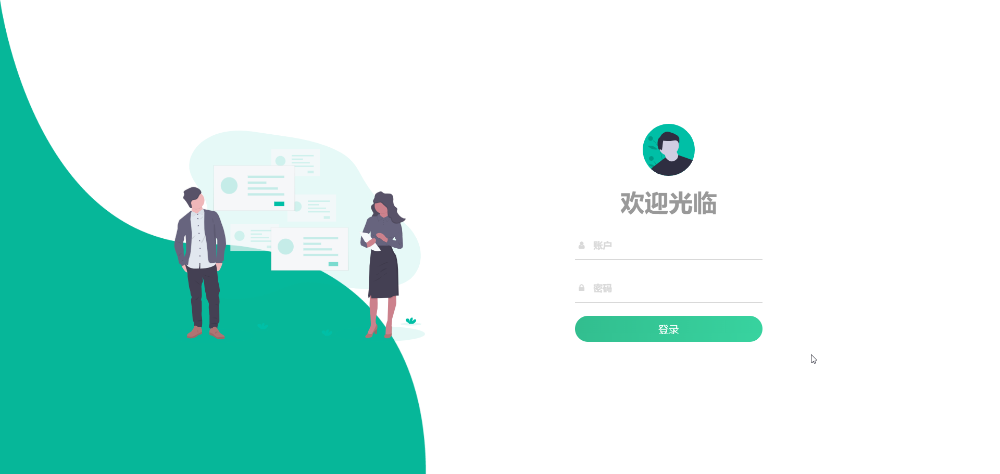

<h1>Yo人事管理系统</h1>
<h4>一款前后端分离的人事管理系统</h4>
<h4 style="color: #38d39f">前端技术栈：Vue + Element-UI + Axios</h4>
<h4 style="color: #00BFFF">后端技术栈：Spring Boot + Mybatis + Spring Security + MySQL + Redis + RabbitMQ + Docker</h4>

## 项目特点

- 前后端分离，通过 **Json** 进行数据交互，前端无需关注后端技术
- 采用 MVC 设计模式，将业务逻辑分层，提高代码的复用性和可维护性
- 采用 **Spring Security** 进行权限认证和授权，实现了基于 **RBAC** 权限控制
- 使用 **MySQL** 数据库对数据进行存储
- 采用 **AOP** + 自定义注解 + **枚举** 实现对请求监听记录
- 采用 **RabbitMQ** 实现了 **消息通知** 功能
- 采用 **Docker** 容器化部署，解决 **中间件** 的繁杂部署问题
- 基于 **Redis** 实现缓存报表、锁功能，提高系统性能。
- 页面交互使用 **Vue2.x**，极大的提高了开发效率

## 项目截图

### 登录

### 主页

### 员工资料-高级资料

### 员工资料-基础资料

### 员工工资套

### 工资套管理

### 系统管理-基础设置

### 操作日志

### 系统管理-操作员管理

### 数据统计-综合统计

### 数据统计-人事统计

### 数据统计-积分统计

### 聊天室

### 如何安装使用?

#### 前端

1、安装依赖：npm i

2、启动项目：npm run serve

#### 后端

1、需要再 **docker** 中安装 **MySQL**、**Redis**、**Rabbit** (如果不使用恢复数据库功能，可都不用装到docker中)

2、将 asset 中的 sql 导入数据库中

3、配置 **application.yml** 文件，修改数据库连接、Redis连接、RabbitMQ连接等信息

4、运行 mail-server服务、hr-server服务